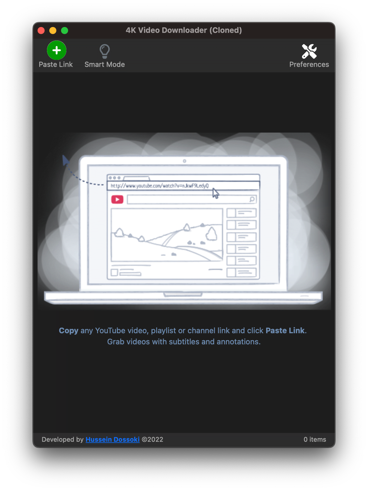

<p align="center">
  
</p>

# A Clone of 4K Video Downloader [](https://github.com/HusseinDossoki/4k-video-downloader-clone/blob/dev/LICENSE)

A *Clone* of [4K Video Downloader](https://www.4kdownload.com/-arokg/video-downloader) written in [Rust](https://www.rust-lang.org/) with [Tauri](https://tauri.app/), themed to look exactly like *4K Video Downloader*, with complex features like download speed, download playlists, smart mode etc.

<div align="center">


<br/>*App Demo*

</div>

## Screenshots



## Features
* **Download Speed** is one of the most important characteristics that distinguish our program compared to the original program
* **Binary Size** is small, **~7MB** compared to **~400MB** for the original program
* **Memory Usage** is very small because of using Rust 💙 as a backend language
* **Cross Platform** that is designed to work in several computing platforms (Windows, Mac, Linux)

## Libraries Used

#### Frontend

* [Vue3](https://vuejs.org/) - See [`source code`](./src)
* [bootstrap](https://getbootstrap.com/) - frontend toolkit

#### Backend

* [Rust](https://www.rust-lang.org/) and [Tauri](https://tauri.app/) framework - See [`source code`](./src-tauri)
* [rustube](https://docs.rs/rustube/latest/rustube/) - Rust crate for A complete (WIP), and easy to use YouTube downloader.


## Set up your dev environment
1) Download and Install [Visual Studio Code](https://code.visualstudio.com/)
1) Download and Install [Rust](https://www.rust-lang.org/tools/install)
1) Download and Install [Node Js](https://nodejs.org/en/download/)

## Development

1) Clone the Git repository

```sh
git clone https://github.com/HusseinDossoki/4k-video-downloader-clone
```

2) CD into the folder

```sh
cd 4k-video-downloader-clone
```

3) Install node dependencies 

```sh
npm install
```

3) Start the tauri dev server

```sh
npm tauri run dev
```